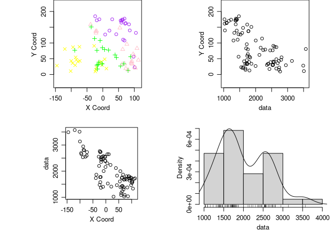
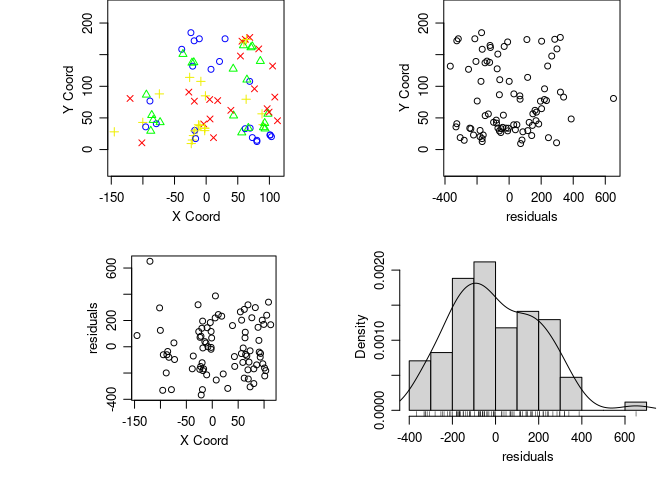
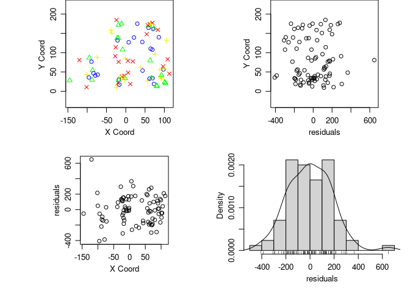
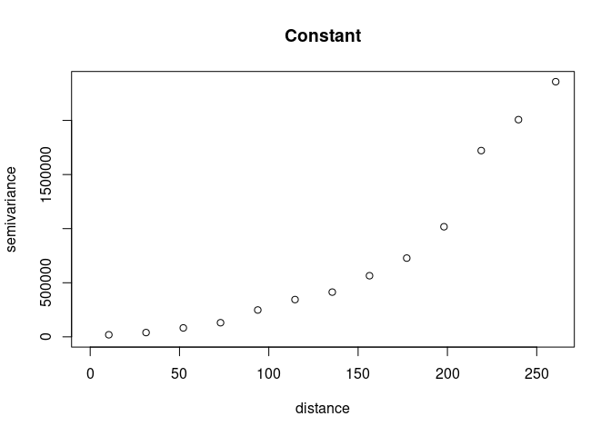
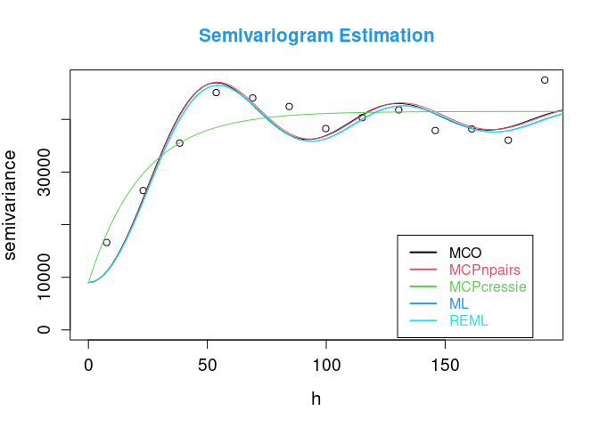
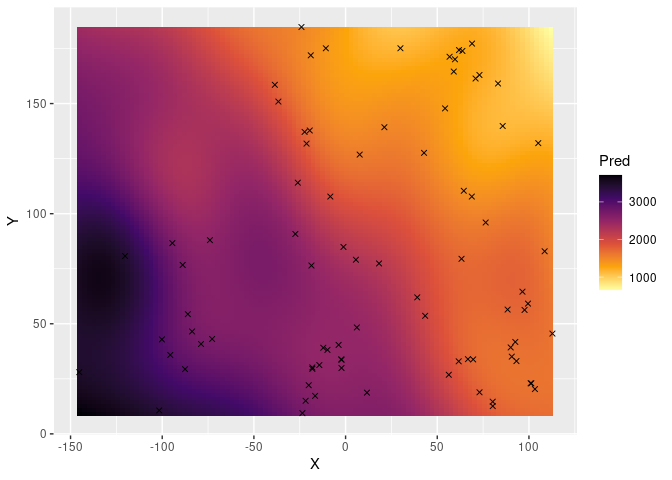
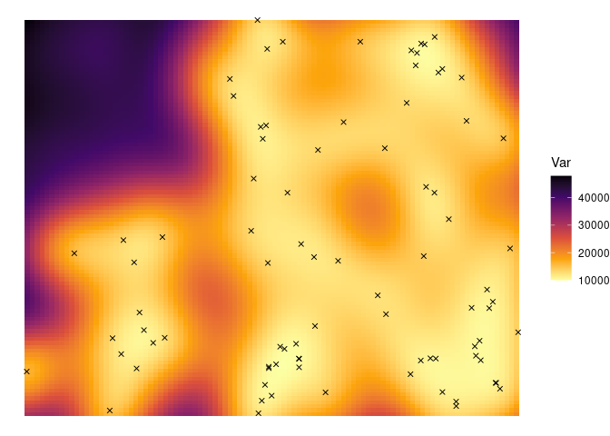

Geostatistics
================

## Check Working directory

``` r
getwd()
```

    ## [1] "/home/juan/Documents/Inves/Webinar/Day1/1_Aquifer_GEO_R"

``` r
list.files()
```

    ## [1] "aquifer.txt"   "Example_files" "Example.html"  "Example.md"   
    ## [5] "Example.Rmd"

``` r
getwd()
```

    ## [1] "/home/juan/Documents/Inves/Webinar/Day1/1_Aquifer_GEO_R"

## R packages

``` r
library(geoR)
```

    ## 'RandomFieldsUtils' will use OMP
    ## 'RandomFields' will use OMP

    ## --------------------------------------------------------------
    ##  Analysis of Geostatistical Data
    ##  For an Introduction to geoR go to http://www.leg.ufpr.br/geoR
    ##  geoR version 1.8-1 (built on 2020-02-08) is now loaded
    ## --------------------------------------------------------------

``` r
library(ggplot2)
# library(akima)
# library(fields)
# require(graphics)
# rmarkdown::render("Ejemplo_aquifer_geoR.Rmd")
# rmarkdown::render("Example.Rmd")
```

-   [geoR
    documentation](https://cran.r-project.org/web/packages/geoR/geoR.pdf)

## Data

``` r
aquifer <- read.table("aquifer.txt", head = TRUE, dec = ",")
head(aquifer)
summary(aquifer)
```

Summary aquifer

|     | Este            | Norte           | Profundidad  |
|:----|:----------------|:----------------|:-------------|
|     | Min. :-145.24   | Min. : 9.414    | Min. :1024   |
|     | 1st Qu.: -21.30 | 1st Qu.: 33.682 | 1st Qu.:1548 |
|     | Median : 11.66  | Median : 59.158 | Median :1797 |
|     | Mean : 16.89    | Mean : 79.361   | Mean :2002   |
|     | 3rd Qu.: 70.90  | 3rd Qu.:131.825 | 3rd Qu.:2540 |
|     | Max. : 112.80   | Max. :184.766   | Max. :3571   |

## GEO\_Data

### Data frame to GEO\_Data

-   Documentation
    [as.geodata](https://cran.r-project.org/web/packages/geoR/geoR.pdf#page=5)

``` r
aquiferg <- as.geodata(aquifer)
summary(aquiferg)
```

    ## Number of data points: 85 
    ## 
    ## Coordinates summary
    ##          Este     Norte
    ## min -145.2365   9.41441
    ## max  112.8045 184.76636
    ## 
    ## Distance summary
    ##         min         max 
    ##   0.2211656 271.0615463 
    ## 
    ## Data summary
    ##     Min.  1st Qu.   Median     Mean  3rd Qu.     Max. 
    ## 1024.000 1548.000 1797.000 2002.282 2540.000 3571.000

### Plot GEO\_Data Objtect

-   Documentation
    [plotgeodata](https://cran.r-project.org/web/packages/geoR/geoR.pdf#page=85)

``` r
plot(aquiferg, qt.col = c("purple",
                         "pink",
                         "green",
                         "yellow"))
```

<!-- -->

Scatter 3d

``` r
plot(aquiferg, scatter3d = T)
```

<!-- -->

the mean part of the model

``` r
plot(aquiferg, trend = "1st")
```

<!-- -->

``` r
plot(aquiferg, trend = "2nd")
```

<!-- --> \# Mean part
of the model

## Model 1

``` r
reg1 <- lm(Profundidad ~ Este + Norte, data = aquifer)
residuales1  <-  residuals(reg1)

summary(reg1)
anova(reg1)
```

|                 | Estimate | Std. Error | t value | Pr(&gt;\|t\|) |
|:---------------:|:--------:|:----------:|:-------:|:-------------:|
| **(Intercept)** |   2591   |   38.96    |  66.52  |   4.05e-73    |
|    **Este**     |  -6.751  |   0.3438   | -19.64  |   9.637e-33   |
|    **Norte**    |  -5.987  |   0.4066   | -14.73  |   9.631e-25   |

| Observations | Residual Std. Error |  | Adjusted  |
|:------------:|:-------------------:|:--------------------------------------------------------:|:-----------------------------------------------------------------:|
|      85      |        203.3        |                          0.8921                          |                              0.8894                               |

Fitting linear model: Profundidad \~ Este + Norte

|               | Df  |  Sum Sq  | Mean Sq  | F value | Pr(&gt;F) |
|:-------------:|:---:|:--------:|:--------:|:-------:|:---------:|
|   **Este**    |  1  | 19045642 | 19045642 |   461   | 2.087e-35 |
|   **Norte**   |  1  | 8960172  | 8960172  |  216.9  | 9.631e-25 |
| **Residuals** | 82  | 3388069  |  41318   |   NA    |    NA     |

Analysis of Variance Table

## Model 2

``` r
reg2 <- lm(Profundidad ~ Este + Norte +
           I(Este^2) + I(Norte^2) +
           I(Este * Norte),
           data = aquifer)
residuales2  <-  residuals(reg2)
summary(reg2)
anova(reg2)
```

|                 | Estimate | Std. Error | t value | Pr(&gt;\|t\|) |
|:---------------:|:--------:|:----------:|:-------:|:-------------:|
| **(Intercept)** |   2591   |   38.96    |  66.52  |   4.05e-73    |
|    **Este**     |  -6.751  |   0.3438   | -19.64  |   9.637e-33   |
|    **Norte**    |  -5.987  |   0.4066   | -14.73  |   9.631e-25   |

| Observations | Residual Std. Error |  | Adjusted  |
|:------------:|:-------------------:|:--------------------------------------------------------:|:-----------------------------------------------------------------:|
|      85      |        203.3        |                          0.8921                          |                              0.8894                               |

Fitting linear model: Profundidad \~ Este + Norte

|               | Df  |  Sum Sq  | Mean Sq  | F value | Pr(&gt;F) |
|:-------------:|:---:|:--------:|:--------:|:-------:|:---------:|
|   **Este**    |  1  | 19045642 | 19045642 |   461   | 2.087e-35 |
|   **Norte**   |  1  | 8960172  | 8960172  |  216.9  | 9.631e-25 |
| **Residuals** | 82  | 3388069  |  41318   |   NA    |    NA     |

Analysis of Variance Table

## Model 3

``` r
reg3 <- lm(Profundidad ~ Este * Norte,
           data = aquifer)
residuales3  <-  residuals(reg3)
summary(reg3)
anova(reg3)
```

|                 | Estimate | Std. Error | t value | Pr(&gt;\|t\|) |
|:---------------:|:--------:|:----------:|:-------:|:-------------:|
| **(Intercept)** |   2627   |   38.33    |  68.55  |   1.692e-73   |
|    **Este**     |  -8.287  |   0.5658   | -14.65  |   1.779e-24   |
|    **Norte**    |  -6.649  |   0.4327   | -15.37  |   1.005e-25   |
| **Este:Norte**  | 0.02452  |  0.007401  |  3.314  |   0.001379    |

| Observations | Residual Std. Error |  | Adjusted  |
|:------------:|:-------------------:|:--------------------------------------------------------:|:-----------------------------------------------------------------:|
|      85      |        191.9        |                          0.905                           |                              0.9014                               |

Fitting linear model: Profundidad \~ Este \* Norte

|                | Df  |  Sum Sq  | Mean Sq  | F value | Pr(&gt;F) |
|:--------------:|:---:|:--------:|:--------:|:-------:|:---------:|
|    **Este**    |  1  | 19045642 | 19045642 |  517.1  | 6.498e-37 |
|   **Norte**    |  1  | 8960172  | 8960172  |  243.3  | 4.073e-26 |
| **Este:Norte** |  1  |  404448  |  404448  |  10.98  | 0.001379  |
| **Residuals**  | 81  | 2983621  |  36835   |   NA    |    NA     |

Analysis of Variance Table \# Empirical semivariogram

-   Documentation
    [variog](https://cran.r-project.org/web/packages/geoR/geoR.pdf#page=133)

``` r
vari2 <- variog(aquiferg, trend = "1st")
vari2Cloud <- variog(aquiferg, op = "cloud", trend = "1st")
vari2BinCloud <- variog(aquiferg,
                       max.dist = 200,
                       op = "cloud",
                       bin.cloud = TRUE)
vari2Sm <- variog(aquiferg,
                  trend = "1st",
                  op = "sm",
                  band=11)
```

``` r
par(mfrow = c(2, 2), mar = c(3, 3, 1, 1), mgp = c(2, 1, 0))
     plot(vari2, main = "binned variogram")
     plot(vari2Cloud, main = "variogram cloud")
     plot(vari2BinCloud,main = "clouds for binned variogram")
     plot(vari2Sm, main = "smoothed variogram")
```

<!-- -->

## Classic estimation

``` r
vari1 <- variog(aquiferg)
vari2 <- variog(aquiferg, trend = "1st")
vari3 <- variog(aquiferg, trend = "2nd")
```

``` r
plot(vari1, main =  "Constant")
```

<!-- -->

``` r
plot(vari2, main  = "Trend 1 ")
```

<!-- -->

``` r
plot(vari3, main  = "Trend 2 ")
```

<!-- -->

## Anisotropy

``` r
vari_0 <- variog(aquiferg,
                 trend = "1st",
                 max.dist = 200,
                 dir = 0)

vari_45 <- variog(aquiferg,
                  trend = "1st",
                  max.dist = 200,
                  dir = pi / 4)
vari_90 <- variog(aquiferg,
                  trend = "1st",
                  max.dist = 200,
                  dir = pi / 2)
vari_135 <- variog(aquiferg,
                   trend = "1st",
                   max.dist = 200,
                   dir = 3 * pi / 4)
par(mfrow = c(2, 2),
    mar = c(3, 3, 1, 1),
    mgp = c(2, 1, 0))

plot(vari_0, main = "vari 0")
plot(vari_45, main = "vari 45")
plot(vari_90, main = "vari 90")
plot(vari_135, main = "vari 195")
```

<!-- -->

## Theoretical estimation

-   Documentation
    [eyefit](https://cran.r-project.org/web/packages/geoR/geoR.pdf#page=25)
-   Documentation
    [variofit](https://cran.r-project.org/web/packages/geoR/geoR.pdf#page=129)
-   Documentation
    [likfit](https://cran.r-project.org/web/packages/geoR/geoR.pdf#page=60)

``` r
var1 <- variog(aquiferg,
               trend = "1st",
               max.dist = 200)


#ini1 <- eyefit(var1)
#cov.model  sigmasq phi   tausq kappa kappa2   practicalRange
#1      wave 30805.52  13 8984.94  <NA>   <NA> 38.8889336320589
ini1 <- c(30805.52, 13)
fitvar1 <- variofit(var1,
                    cov.model = "wave",
                    ini1,
                    fix.nugget = TRUE,
                    nugget = 8984.94,
                    wei = "equal")

fitvar2 <- variofit(var1,
                    cov.model = "wave",
                    ini1,
                    fix.nugget = TRUE,
                    nugget = 8984.94,
                    wei = "npairs")

fitvar3 <- variofit(var1,
                    ini1,
                    fix.nugget = TRUE,
                    nugget = 8984.94,
                    wei = "cressie")


fitvar4 <- likfit(aquiferg,
                  coords = aquiferg$coords,
                  data = aquiferg$data,
                  trend = "1st",
                  ini.cov.pars = ini1,
                  fix.nugget = T,
                  nugget = 8984.94,
                  cov.model = "wave",
                  lik.method = "ML")

fitvar5 <- likfit(aquiferg,
                  coords = aquiferg$coords,
                  data = aquiferg$data,
                  trend = "1st",
                  ini.cov.pars = ini1,
                  fix.nugget = T,
                  nugget = 8984.94,
                  cov.model = "wave",
                  lik.method = "REML")
```

``` r
plot(var1,
     xlab = "h",
     ylab = "semivariance",
     cex.lab = 1.3,
     cex.axis = 1.2,
     main = "Semivariogram Estimation",
     col.main = 4, cex.main = 1.3)
lines(fitvar1, col = 1)
lines(fitvar2, col = 2)
lines(fitvar3, col = 3)
lines(fitvar4, col = 4)
lines(fitvar5, col = 5)
legend(130, 18000,
       c("MCO", "MCPnpairs", "MCPcressie", "ML", "REML"),
       lwd = 2,
       col = 1:5,
       box.col = 9,
       text.col = 1:5)
```

<!-- -->

# Results

``` r
summary(fitvar1)
```

    ## $pmethod
    ## [1] "OLS (ordinary least squares)"
    ## 
    ## $cov.model
    ## [1] "wave"
    ## 
    ## $spatial.component
    ##     sigmasq         phi 
    ## 31203.33666    11.93873 
    ## 
    ## $spatial.component.extra
    ## kappa 
    ##   0.5 
    ## 
    ## $nugget.component
    ##   tausq 
    ## 8984.94 
    ## 
    ## $fix.nugget
    ## [1] TRUE
    ## 
    ## $fix.kappa
    ## [1] TRUE
    ## 
    ## $practicalRange
    ## [1] 35.71419
    ## 
    ## $sum.of.squares
    ##     value 
    ## 159338722 
    ## 
    ## $estimated.pars
    ##     sigmasq         phi 
    ## 31203.33666    11.93873 
    ## 
    ## $weights
    ## [1] "equal"
    ## 
    ## $call
    ## variofit(vario = var1, ini.cov.pars = ini1, cov.model = "wave", 
    ##     fix.nugget = TRUE, nugget = 8984.94, weights = "equal")
    ## 
    ## attr(,"class")
    ## [1] "summary.variomodel"

``` r
summary(fitvar2)
```

    ## $pmethod
    ## [1] "WLS (weighted least squares)"
    ## 
    ## $cov.model
    ## [1] "wave"
    ## 
    ## $spatial.component
    ##     sigmasq         phi 
    ## 31311.81332    12.05997 
    ## 
    ## $spatial.component.extra
    ## kappa 
    ##   0.5 
    ## 
    ## $nugget.component
    ##   tausq 
    ## 8984.94 
    ## 
    ## $fix.nugget
    ## [1] TRUE
    ## 
    ## $fix.kappa
    ## [1] TRUE
    ## 
    ## $practicalRange
    ## [1] 36.07688
    ## 
    ## $sum.of.squares
    ##       value 
    ## 32922890311 
    ## 
    ## $estimated.pars
    ##     sigmasq         phi 
    ## 31311.81332    12.05997 
    ## 
    ## $weights
    ## [1] "npairs"
    ## 
    ## $call
    ## variofit(vario = var1, ini.cov.pars = ini1, cov.model = "wave", 
    ##     fix.nugget = TRUE, nugget = 8984.94, weights = "npairs")
    ## 
    ## attr(,"class")
    ## [1] "summary.variomodel"

``` r
summary(fitvar3)
```

    ## $pmethod
    ## [1] "WLS (weighted least squares)"
    ## 
    ## $cov.model
    ## [1] "matern"
    ## 
    ## $spatial.component
    ##     sigmasq         phi 
    ## 32541.18204    22.69704 
    ## 
    ## $spatial.component.extra
    ## kappa 
    ##   0.5 
    ## 
    ## $nugget.component
    ##   tausq 
    ## 8984.94 
    ## 
    ## $fix.nugget
    ## [1] TRUE
    ## 
    ## $fix.kappa
    ## [1] TRUE
    ## 
    ## $practicalRange
    ## [1] 67.99426
    ## 
    ## $sum.of.squares
    ##    value 
    ## 26.97852 
    ## 
    ## $estimated.pars
    ##     sigmasq         phi 
    ## 32541.18204    22.69704 
    ## 
    ## $weights
    ## [1] "cressie"
    ## 
    ## $call
    ## variofit(vario = var1, ini.cov.pars = ini1, fix.nugget = TRUE, 
    ##     nugget = 8984.94, weights = "cressie")
    ## 
    ## attr(,"class")
    ## [1] "summary.variomodel"

``` r
summary(fitvar4)
```

    ## Summary of the parameter estimation
    ## -----------------------------------
    ## Estimation method: maximum likelihood 
    ## 
    ## Parameters of the mean component (trend):
    ##     beta0     beta1     beta2 
    ## 2723.1654   -7.1140   -6.9505 
    ## 
    ## Parameters of the spatial component:
    ##    correlation function: wave
    ##       (estimated) variance parameter sigmasq (partial sill) =  30806
    ##       (estimated) cor. fct. parameter phi (range parameter)  =  12.11
    ##    anisotropy parameters:
    ##       (fixed) anisotropy angle = 0  ( 0 degrees )
    ##       (fixed) anisotropy ratio = 1
    ## 
    ## Parameter of the error component:
    ##       (fixed) nugget = 8984.94
    ## 
    ## Transformation parameter:
    ##       (fixed) Box-Cox parameter = 1 (no transformation)
    ## 
    ## Practical Range with cor=0.05 for asymptotic range: 36.2227
    ## 
    ## Maximised Likelihood:
    ##    log.L n.params      AIC      BIC 
    ## "-572.8"      "5"   "1156"   "1168" 
    ## 
    ## non spatial model:
    ##    log.L n.params      AIC      BIC 
    ## "-570.8"      "4"   "1150"   "1159" 
    ## 
    ## Call:
    ## likfit(geodata = aquiferg, coords = aquiferg$coords, data = aquiferg$data, 
    ##     trend = "1st", ini.cov.pars = ini1, fix.nugget = T, nugget = 8984.94, 
    ##     cov.model = "wave", lik.method = "ML")

``` r
summary(fitvar5)
```

    ## Summary of the parameter estimation
    ## -----------------------------------
    ## Estimation method: restricted maximum likelihood 
    ## 
    ## Parameters of the mean component (trend):
    ##     beta0     beta1     beta2 
    ## 2723.0308   -7.1143   -6.9479 
    ## 
    ## Parameters of the spatial component:
    ##    correlation function: wave
    ##       (estimated) variance parameter sigmasq (partial sill) =  30806
    ##       (estimated) cor. fct. parameter phi (range parameter)  =  12.16
    ##    anisotropy parameters:
    ##       (fixed) anisotropy angle = 0  ( 0 degrees )
    ##       (fixed) anisotropy ratio = 1
    ## 
    ## Parameter of the error component:
    ##       (fixed) nugget = 8984.94
    ## 
    ## Transformation parameter:
    ##       (fixed) Box-Cox parameter = 1 (no transformation)
    ## 
    ## Practical Range with cor=0.05 for asymptotic range: 36.38468
    ## 
    ## Maximised Likelihood:
    ##    log.L n.params      AIC      BIC 
    ## "-553.2"      "5"   "1116"   "1129" 
    ## 
    ## non spatial model:
    ##    log.L n.params      AIC      BIC 
    ## "-552.1"      "4"   "1112"   "1122" 
    ## 
    ## Call:
    ## likfit(geodata = aquiferg, coords = aquiferg$coords, data = aquiferg$data, 
    ##     trend = "1st", ini.cov.pars = ini1, fix.nugget = T, nugget = 8984.94, 
    ##     cov.model = "wave", lik.method = "REML")

# Prediction

``` r
pred.grid <-  expand.grid(seq(-145, 112, l = 100),
                          seq(9, 184, l = 100))
# kriging calculations
kc_pred <- krige.conv(aquiferg,
                 loc = pred.grid,
                 krige = krige.control(obj.model = fitvar1))
```

    ## krige.conv: model with mean given by a 1st order polynomial on the coordinates
    ## krige.conv: Kriging performed using global neighbourhood

``` r
# displaying predicted values
```

``` r
predicted_df <- data.frame(X = pred.grid$Var1,
                           Y = pred.grid$Var2,
                           Pred = kc_pred$predict,
                           Var = kc_pred$krige.var)

coors <- data.frame(X = aquiferg$c[, 1],
                    Y = aquiferg$c[, 2])
plot_prediction <-
    ggplot() +
        geom_tile(data = predicted_df,
                  mapping = aes(x = X, y = Y, fill = Pred)) +
        scale_fill_viridis_c(option = "inferno",
                             direction = -1) +
        geom_point(data = coors, mapping = aes(x = X, y = Y), shape = 4)

plot_variance <-
    ggplot() +
        geom_tile(data = predicted_df,
                  mapping = aes(x = X, y = Y, fill = Var)) +
        scale_fill_viridis_c(option = "inferno",
                             direction = -1) +
        geom_point(data = coors, mapping = aes(x = X, y = Y), shape = 4) +
        theme_void()

plot_prediction
```

<!-- -->

``` r
plot_variance
```

<!-- -->
